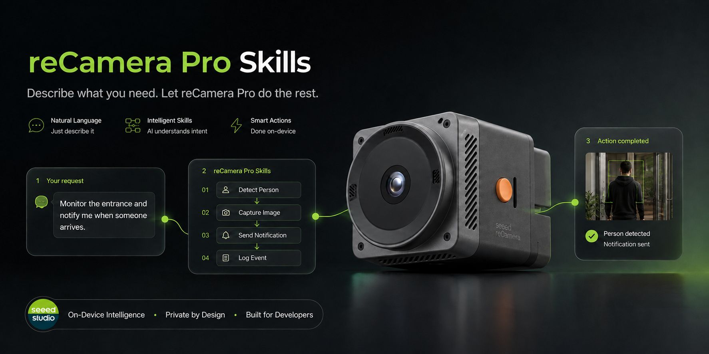

# 面向 Codex 的 Seeed reCamera Pro 开发 Skill

[English](README.md)

<p align="center">
  
</p>

通过自然语言与 Codex 对话，完成 Seeed reCamera Pro 应用开发。

安装这个 skill 后，你只需要描述想实现的功能，例如开发 AI 摄像头应用、转换 ONNX 模型、使用麦克风和扬声器，或者输出带推理结果的 RTSP 视频流。Codex 会自动使用仓库中针对 reCamera Pro 准备的开发流程、工具和硬件知识。

## 选择对应的 Agent 分支

请根据使用的 Agent 克隆对应分支。各分支包含相同的 reCamera Pro 开发流程，只调整安装路径和使用说明。

| Agent | 分支 | 用户级 Skill 目录 |
| --- | --- | --- |
| OpenAI Codex | `main` | `~/.agents/skills/recamera-rknn-dev` |
| Claude Code | `claude-code` | `~/.claude/skills/recamera-rknn-dev` |
| GitHub Copilot | `github-copilot` | `~/.copilot/skills/recamera-rknn-dev` |
| Cursor | `cursor` | `~/.cursor/skills/recamera-rknn-dev` |
| Gemini CLI | `gemini-cli` | `~/.gemini/skills/recamera-rknn-dev` |

当前 `main` 分支是 Codex 版本。


## 可以让 Codex 完成什么

### 转换 AI 模型

让 Codex 把 ONNX 模型转换为 RV1126B NPU 使用的 RKNN 模型。Skill 会确保 RKNN-Toolkit2 和 RKNN Runtime 固定使用 2.3.2，检查模型输入输出，根据需求完成 FP16 或 INT8 转换，并保留转换参数和文件校验信息。

例如：

> 使用 reCamera Pro skill，把我的 `model.onnx` 转换成 RV1126B 使用的 RKNN 模型。

### 开发原生 AI 应用

让 Codex 创建或修改使用 RKNN Runtime 的 C/C++ 应用。Skill 包含 reCamera Pro 的 aarch64 目标信息、交叉编译要求、sysroot 结构、运行库路径、ABI 校验和部署约束。

例如：

> 为 reCamera Pro 开发一个获取摄像头画面并运行 RKNN 目标检测模型的应用。

### 使用摄像头、麦克风和扬声器

Skill 包含经过设备验证的摄像头节点、ALSA 音频设备、麦克风采集、扬声器播放、设备占用问题和支持格式等信息。

例如：

> 为我的 reCamera Pro 应用增加麦克风录音和扬声器播放功能。

### 开发 GStreamer 和 RTSP 应用

让 Codex 检查板端可用的 GStreamer 插件，准备交叉编译依赖，读取或发布 RTSP 视频流，并把推理结果集成到多媒体应用中。

例如：

> 为 reCamera Pro 创建一个 RTSP 推理应用，并准备所需的交叉编译依赖。

### 检查和修复开发环境

Codex 可以在构建前检查主机环境、交叉工具链、sysroot、目标库、摄像头和音频设备、GStreamer 插件、ELF 依赖以及 RKNN 版本兼容性。

例如：

> 检查我的电脑是否可以为 reCamera Pro 交叉编译，并补齐缺少的开发依赖。

## 支持的平台

该 skill 专门面向：

- Seeed reCamera Pro
- Rockchip RV1126B
- aarch64 Linux
- RKNN-Toolkit2 2.3.2
- RKNN Runtime 2.3.2

它不适用于 SG2002/riscv64 版本的 reCamera。

## 安装

### 让 Codex 自动安装

可以向 Codex 发送：

```text
请从下面的仓库安装 reCamera Pro development skill：
https://github.com/Seeed-Projects/recamera-pro-development-skill.git
```

### 手动安装

```bash
git clone --branch main --single-branch https://github.com/Seeed-Projects/recamera-pro-development-skill.git
cd recamera-pro-development-skill
./scripts/install_skill.sh
```

默认安装位置：

```text
~/.agents/skills/recamera-rknn-dev
```

Codex 会从这个用户级 Agent Skills 目录发现该 skill。如果当前会话没有显示，请重启 Codex。

## 使用

你可以在请求中明确指定 skill：

> 使用 `$recamera-rknn-dev`，开发一个可以检测行人并通过 RTSP 输出标注视频的 reCamera Pro 应用。

安装后也可以直接使用自然语言描述任务：

> 我有一个 ONNX 检测模型，请把它转换成 reCamera Pro 使用的模型，并创建对应的 C++ 摄像头应用。

Codex 会根据任务自动读取模型转换、交叉编译、摄像头、音频或流媒体相关说明。只有你明确提出并授权时，Codex 才会连接设备、传输文件或在设备上运行程序。

## 仓库包含的内容

仓库包含可复用的 Codex 指令、脚本、技术参考、原生应用模板，以及经过 Seeed 确认的 RKNN Runtime 2.3.2 交叉链接库。具体技术命令被保留在 skill 内部，用户可以主要通过自然语言完成开发。

正式开源前，仓库所有者仍需补充适用的项目许可证，以及二进制组件所需的声明。
